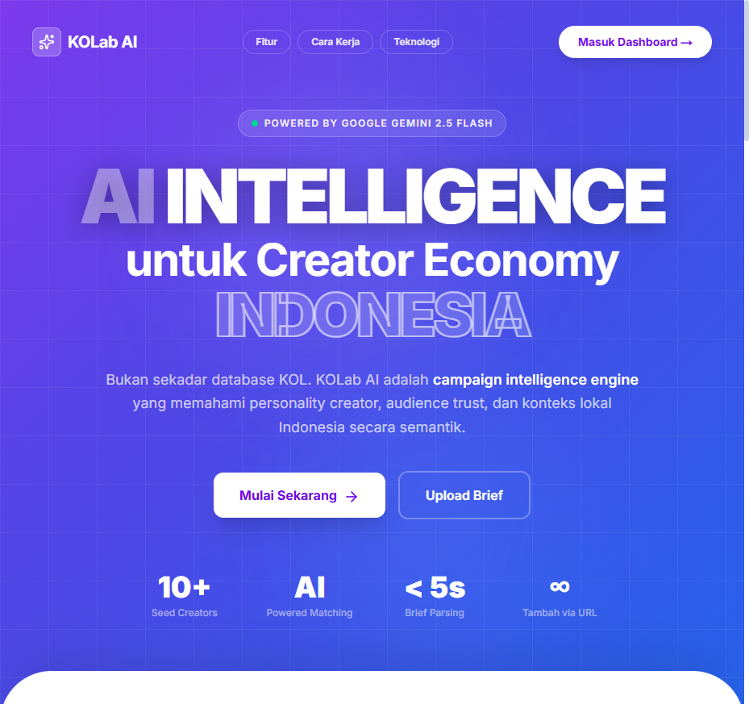
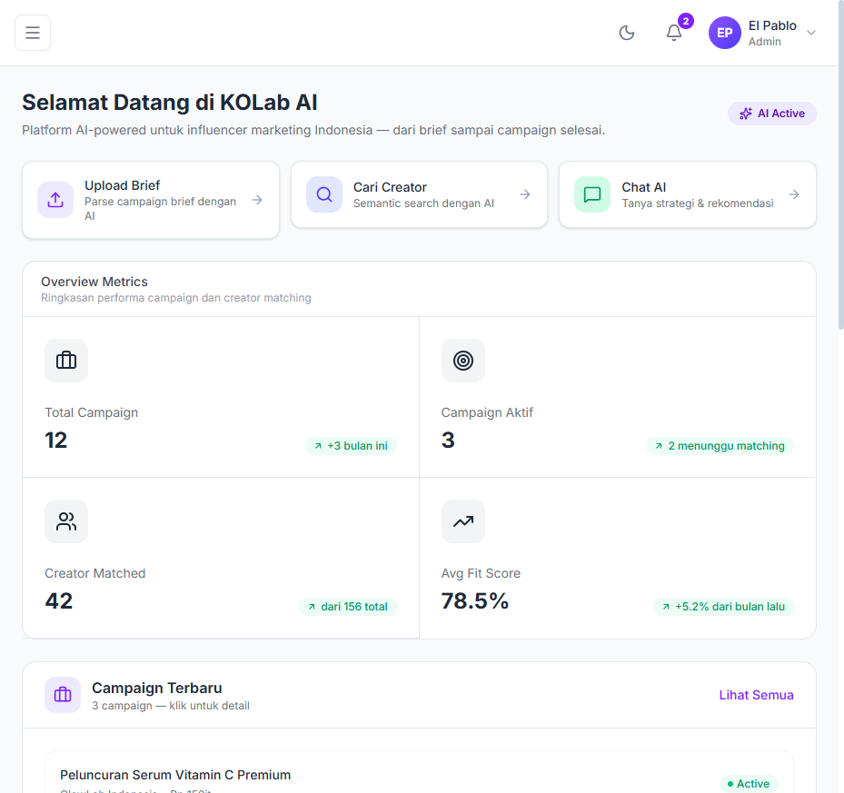
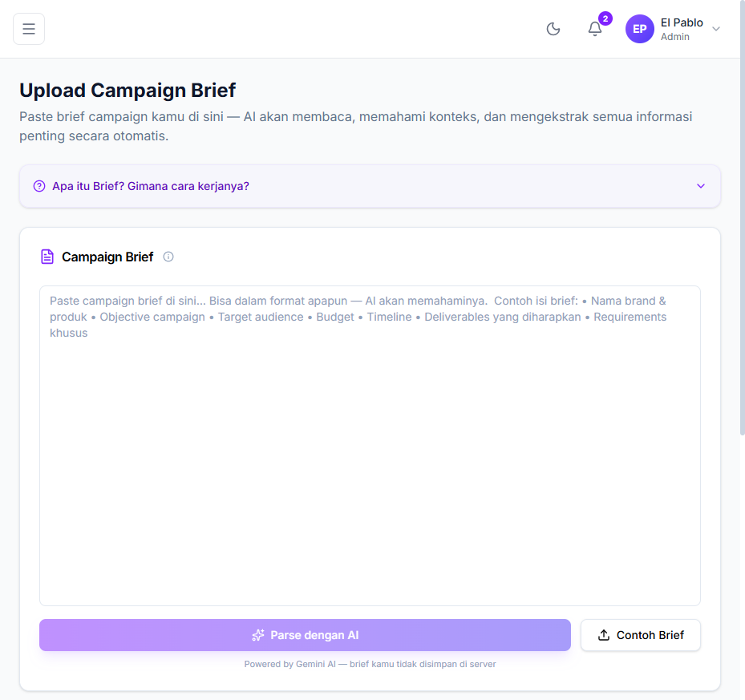
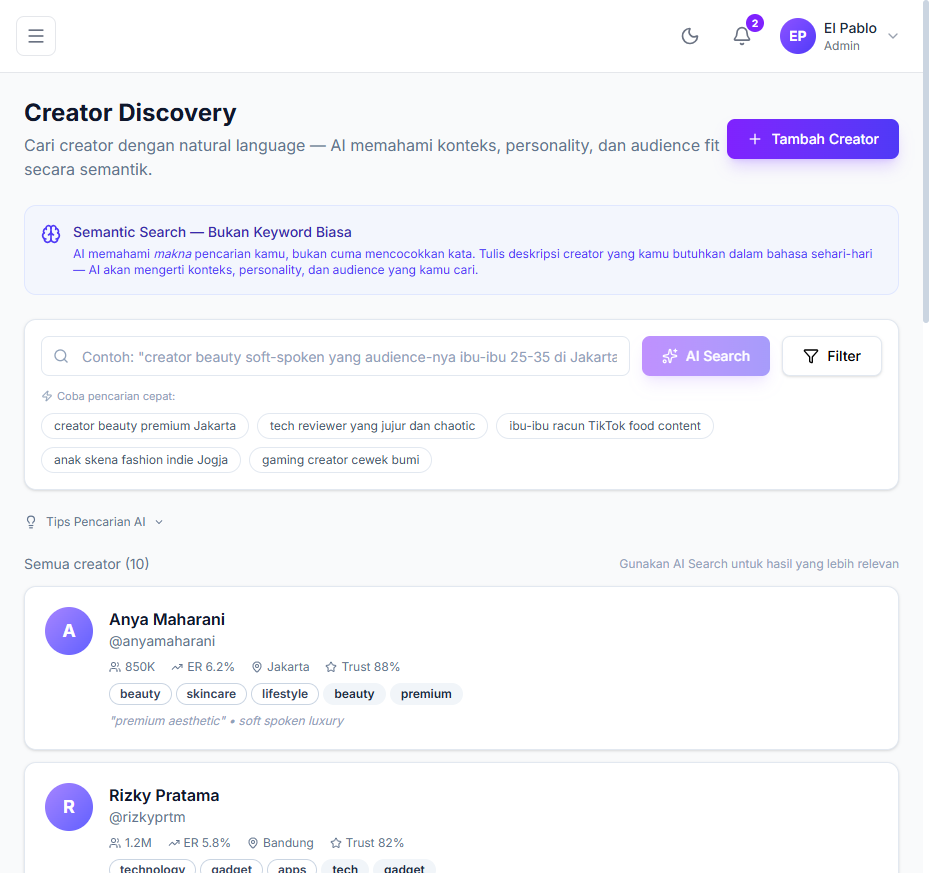
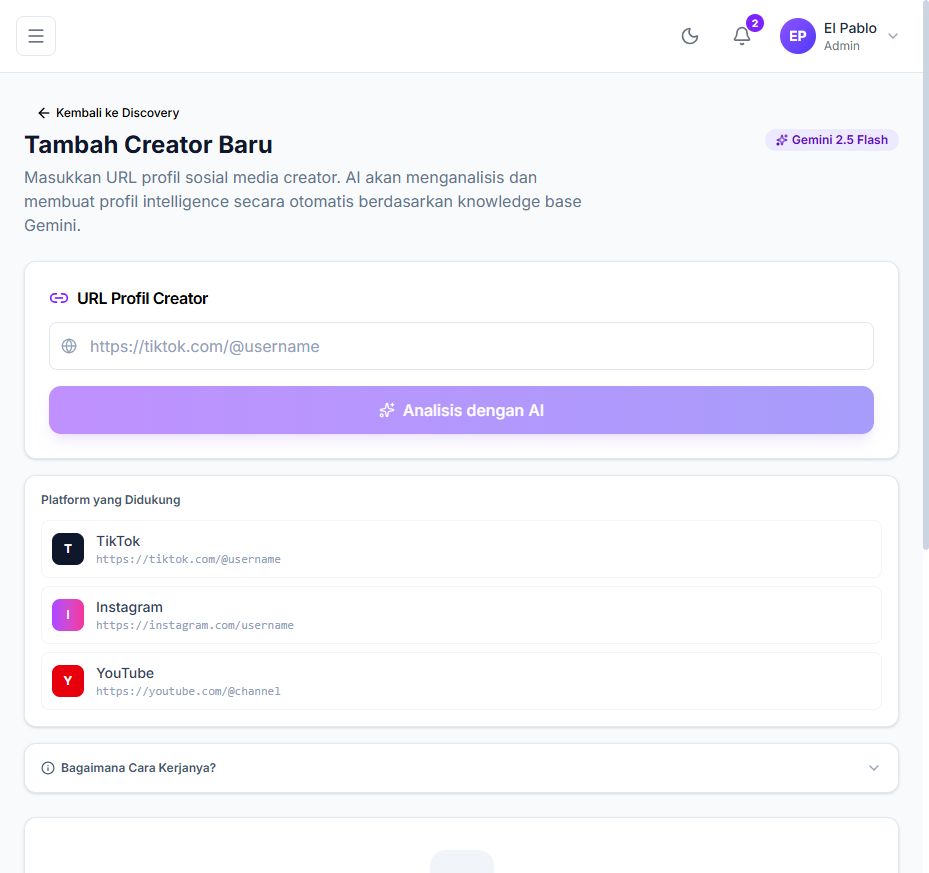
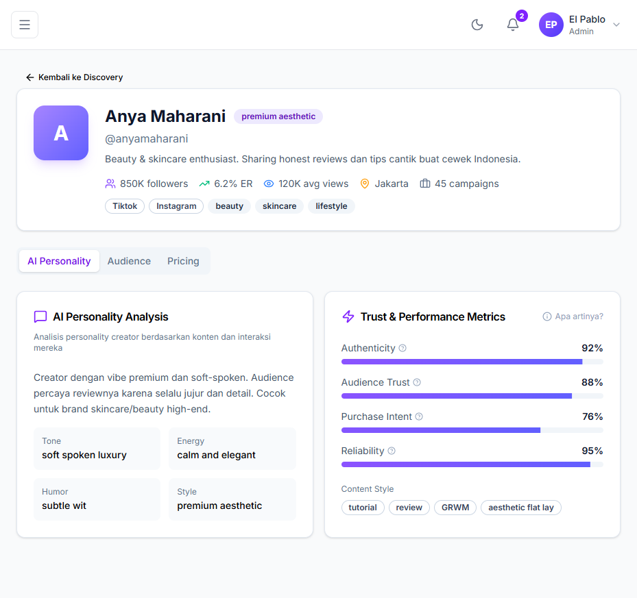
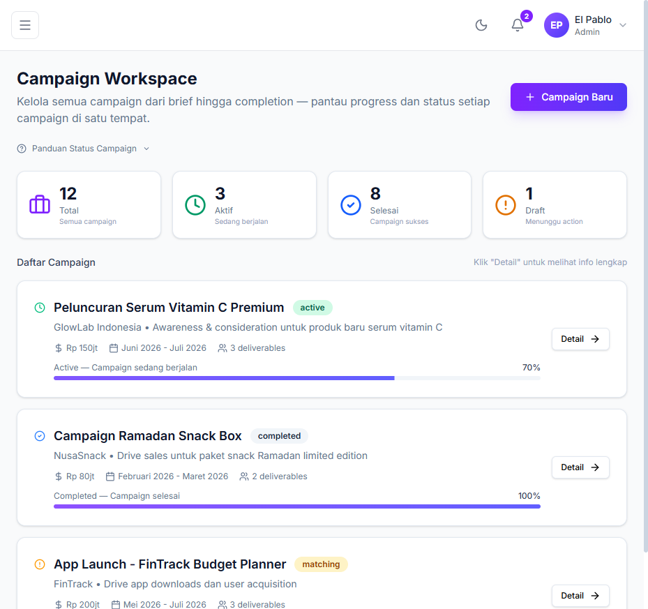
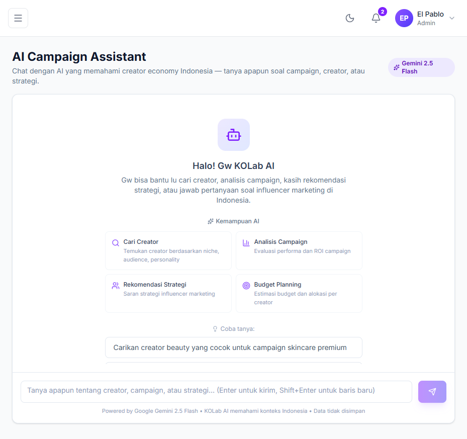
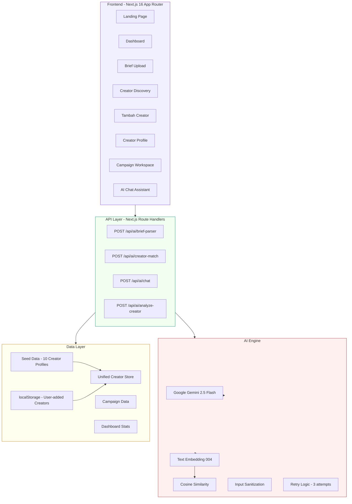
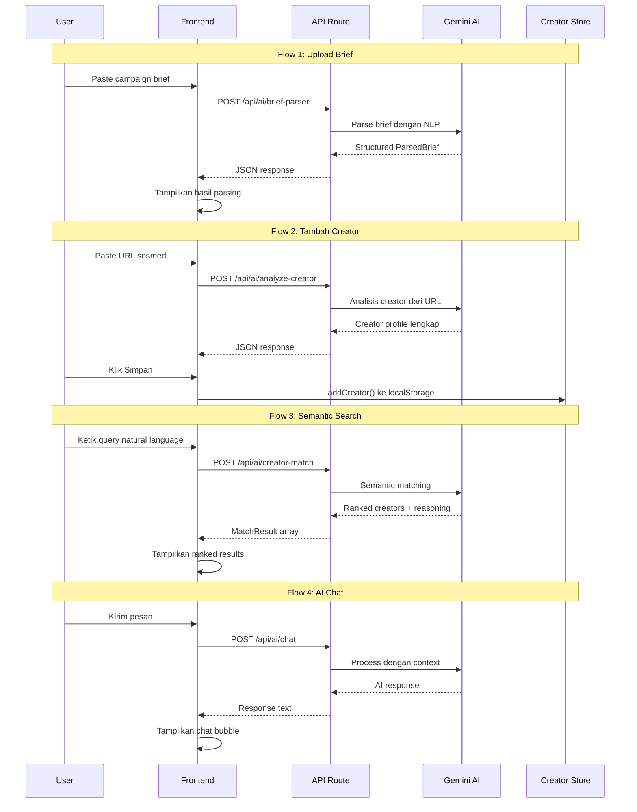

<div align="center">

# KOLab AI

### AI Campaign Intelligence Engine untuk Creator Economy Indonesia

[](https://nextjs.org)
[](https://typescriptlang.org)
[](https://ai.google.dev)
[](https://tailwindcss.com)
[](https://cloud.google.com/run)
[](.)
[](LICENSE)

**Bukan sekadar database KOL. KOLab AI adalah campaign intelligence engine yang memahami personality creator, audience trust, dan konteks lokal Indonesia secara semantik.**

[Live Demo](https://kolab-ai-839794389428.asia-southeast2.run.app) | [Dokumentasi](#arsitektur-sistem) | [Report Bug](https://github.com/el-pablos/kolab-ai/issues)

</div>

---

## Daftar Isi

- [Tentang Projek](#tentang-projek)
- [Masalah yang Diselesaikan](#masalah-yang-diselesaikan)
- [Fitur Utama](#fitur-utama)
- [Screenshots](#screenshots)
- [Arsitektur Sistem](#arsitektur-sistem)
- [Flow Diagram](#flow-diagram)
- [Tech Stack](#tech-stack)
- [Struktur Projek](#struktur-projek)
- [Cara Install dan Jalankan](#cara-install-dan-jalankan)
- [API Endpoints](#api-endpoints)
- [Testing](#testing)
- [Deployment](#deployment)
- [Roadmap](#roadmap)
- [Kontributor](#kontributor)
- [Lisensi](#lisensi)

---

## Tentang Projek

KOLab AI adalah platform AI-native yang dibangun khusus untuk merevolusi cara brand dan agency di Indonesia menemukan serta mengelola creator atau KOL (Key Opinion Leader) untuk campaign mereka. Platform ini dibangun sebagai submission untuk kompetisi **#JuaraVibeCoding 2026** yang diselenggarakan oleh Google Indonesia.

Di Indonesia, platform influencer marketing yang ada sekarang masih bersifat "database + filter" — cari creator berdasarkan followers, engagement rate, lokasi, selesai. Pendekatan itu sudah ketinggalan zaman dan ga cukup untuk kebutuhan brand modern yang butuh pemahaman mendalam tentang creator.

KOLab AI mengambil pendekatan yang fundamentally berbeda: **semantic intelligence**. AI kami yang dipowered oleh Google Gemini 2.5 Flash benar-benar memahami personality creator, audience trust, konteks lokal Indonesia, dan campaign fit secara semantik — bukan sekadar angka-angka di dashboard.

### Kenapa Ini Penting?

Creator economy Indonesia tumbuh pesat. Menurut data terbaru, ada jutaan creator aktif di TikTok, Instagram, dan YouTube Indonesia. Tapi brand masih kesulitan menemukan creator yang benar-benar cocok untuk campaign mereka. Masalahnya bukan kurangnya data — tapi kurangnya intelligence di atas data tersebut.

KOLab AI hadir sebagai "Palantir untuk creator economy" — bukan marketplace, bukan database, tapi intelligence layer yang membantu brand membuat keputusan yang lebih cerdas.

---

## Masalah yang Diselesaikan

### Platform KOL yang Ada Sekarang

Platform seperti Allstars, Kollabo, Slice, dan lainnya sudah menyediakan database creator dengan filter standar. Tapi mereka punya keterbatasan fundamental:

| Aspek | Platform Biasa | KOLab AI |
|-------|---------------|----------|
| Pencarian | Filter: followers, ER, lokasi | Natural language: "cari creator beauty soft-spoken yang audience-nya ibu-ibu 25-35" |
| Matching | Manual shortlist berdasarkan angka | AI semantic matching berdasarkan personality fit |
| Understanding | Database statis dengan metrik surface-level | AI memahami vibe, tone, humor, authenticity creator |
| Brief Processing | Manual input form field by field | Upload brief format apapun, AI auto-parse semua informasi |
| Konteks Lokal | Generic, ga ngerti budaya lokal | Memahami slang, niche, dan budaya creator Indonesia |
| Data Acquisition | Creator harus daftar ke platform | Paste URL sosmed, AI langsung analisis |

### Pertanyaan Kritis: "Data Creator Dari Mana?"

Ini pertanyaan yang paling sering ditanya. Platform KOL existing punya database karena mereka sudah bertahun-tahun collect data dan creator mendaftar ke platform mereka. KOLab AI sebagai platform baru ga mungkin minta creator daftar satu-satu.

**Solusi kami: AI-powered creator analysis.** User cukup paste URL profil TikTok, Instagram, atau YouTube. Gemini AI menganalisis creator berdasarkan knowledge base-nya dan menghasilkan profil intelligence lengkap — personality analysis, audience demographics estimation, engagement quality assessment, dan pricing estimation. Tanpa scraping, tanpa registrasi, tanpa API pihak ketiga.

Untuk creator terkenal (Raditya Dika, Anya Maharani, dll), data yang dihasilkan cukup akurat karena Gemini punya knowledge tentang mereka. Untuk creator yang kurang dikenal, AI memberikan estimasi realistis berdasarkan platform dan niche. Semua hasil ditandai dengan badge "AI Estimation" dan disclaimer yang jujur tentang akurasi data.

---

## Fitur Utama

### 1. Brief Parser AI

Upload campaign brief dalam format apapun — bisa copy-paste dari email, dokumen, atau ketik langsung. AI menganalisis dan mengekstrak semua informasi penting secara otomatis: objective campaign, target audience, tone yang diinginkan, budget, timeline, deliverables, dan requirements. Bahkan AI akan menghasilkan profil creator ideal berdasarkan brief tersebut.

### 2. Semantic Creator Search

Cari creator menggunakan natural language, bukan filter kaku. Ketik "creator beauty soft-spoken yang audience-nya ibu-ibu 25-35 di Jakarta" dan AI akan memahami intent pencarian dan mencocokkan dengan personality creator secara semantik. Setiap hasil dilengkapi dengan fit score dan reasoning AI kenapa creator tersebut cocok.

### 3. Tambah Creator via URL

Fitur killer yang menjawab pertanyaan "data dari mana". Paste URL profil TikTok, Instagram, atau YouTube — AI langsung menganalisis dan menghasilkan profil intelligence lengkap. Termasuk personality analysis, audience demographics, engagement metrics, dan pricing estimation. Creator yang sudah dianalisis otomatis masuk ke database dan bisa di-match dengan campaign.

### 4. AI Personality Profiling

Setiap creator punya AI-generated personality profile yang mencakup tone (soft spoken, chaotic energy, educational), humor style (meme-heavy, dry wit, wholesome), energy level, authenticity score, dan audience trust analysis. Ini yang membedakan KOLab AI dari platform lain — kami ga cuma lihat angka, tapi memahami "vibe" creator.

### 5. AI Campaign Assistant

Chat interface yang memahami konteks campaign dan creator database. Tanya rekomendasi creator, analisis campaign strategy, estimasi budget, atau apapun soal influencer marketing — AI menjawab dengan data dan insight yang actionable. Powered by Gemini 2.5 Flash dengan konteks Indonesia.

### 6. Campaign Workspace

Kelola semua campaign dari brief hingga completion. Track progress setiap campaign, monitor status (draft, briefing, matching, outreach, active, review, completed), dan lihat performance metrics dalam satu dashboard yang clean.

### 7. Dashboard Analytics

Overview lengkap: total campaign, campaign aktif, creator matched, average fit score, budget tracking, dan completion rate. Quick action buttons untuk langsung upload brief, cari creator, atau chat dengan AI.

---

## Screenshots

### Landing Page

*Hero section dengan value proposition, statistik platform, dan penjelasan cara kerja*

### Dashboard

*Overview campaign intelligence: stats cards, campaign terbaru, top creators, budget tracking*

### Upload Brief

*Paste campaign brief, AI auto-parse semua informasi termasuk profil creator ideal*

### Creator Discovery

*Semantic search dengan natural language, suggested queries, dan AI-ranked results*

### Tambah Creator via URL

*Paste URL sosmed, AI analisis profil, platform detection, dan step-by-step loading*

### Creator Profile

*AI personality analysis, trust metrics, audience demographics, content style, dan rate card*

### Campaign Workspace

*Kelola campaign dari brief hingga completion dengan progress tracking dan status badges*

### AI Chat Assistant

*Chat interface dengan suggested questions, kemampuan AI, dan konteks Indonesia*

---

## Arsitektur Sistem



### Penjelasan Arsitektur

**Frontend Layer:** Dibangun dengan Next.js 16 App Router menggunakan TypeScript strict mode. Semua halaman dashboard menggunakan shared layout dengan collapsible sidebar (pattern dari TailAdmin). Animasi menggunakan Framer Motion. UI components menggunakan pattern shadcn/ui dengan Radix UI primitives.

**API Layer:** Empat endpoint utama yang masing-masing menangani satu concern. Setiap endpoint punya input validation, error handling, retry logic, dan standardized response format (`{ success, data, timestamp }`). Response headers include Cache-Control dan X-Content-Type-Options untuk security.

**AI Engine:** Gemini 2.5 Flash sebagai model utama untuk text generation. Text Embedding 004 untuk semantic embeddings. Input sanitization mencegah prompt injection. Retry logic dengan exponential backoff (3 attempts, 1s/2s/4s delay) untuk handle transient failures.

**Data Layer:** Unified Creator Store yang menggabungkan seed data (10 creator profiles hardcoded) dengan user-added creators (disimpan di localStorage). Fungsi `getAllCreators()` digunakan oleh semua halaman untuk mendapatkan data creator yang konsisten.

---

## Flow Diagram



---

## Tech Stack

| Layer | Teknologi | Kenapa Dipilih |
|-------|-----------|----------------|
| **Framework** | Next.js 16 (App Router) | Server components, API routes built-in, optimal performance, standar industri |
| **Language** | TypeScript 5 (strict) | Type safety, better developer experience, fewer runtime bugs |
| **AI Engine** | Google Gemini 2.5 Flash | Cepat, capable, multimodal, gratis via AI Studio, cocok buat kompetisi Google |
| **Styling** | Tailwind CSS 4 | Utility-first, rapid development, consistent design system |
| **UI Components** | shadcn/ui + Radix UI | Accessible, customizable, production-ready, unstyled primitives |
| **Animation** | Framer Motion | Smooth, performant, declarative animations |
| **Icons** | Lucide React | Consistent, lightweight, 1000+ icons, tree-shakeable |
| **Charts** | Recharts | Composable React chart components |
| **Testing** | Jest + Testing Library | Industry standard, reliable, good DX |
| **CI/CD** | GitHub Actions | Auto test dan build on push |
| **Hosting** | Google Cloud Run + Vercel | Cloud Run untuk kompetisi, Vercel untuk preview |
| **Container** | Docker (multi-stage) | Optimized production image, Cloud Run compatible |

---

## Struktur Projek

```
kolab-ai/
├── .github/workflows/
│   └── ci.yml                          # CI/CD pipeline
├── public/images/screenshots/          # Screenshot tiap halaman
├── src/
│   ├── __tests__/                      # Unit tests (40 test cases)
│   │   ├── api/                        # API validation tests
│   │   │   ├── brief-parser.test.ts
│   │   │   ├── chat.test.ts
│   │   │   └── creator-match.test.ts
│   │   └── lib/                        # Library tests
│   │       ├── data.test.ts
│   │       ├── gemini.test.ts
│   │       └── utils.test.ts
│   ├── app/
│   │   ├── (dashboard)/                # Dashboard layout group
│   │   │   ├── brief/page.tsx          # Upload Brief
│   │   │   ├── campaign/page.tsx       # Campaign Workspace
│   │   │   ├── chat/page.tsx           # AI Chat Assistant
│   │   │   ├── creators/
│   │   │   │   ├── page.tsx            # Creator Discovery
│   │   │   │   ├── add/page.tsx        # Tambah Creator via URL
│   │   │   │   └── [id]/page.tsx       # Creator Profile Detail
│   │   │   ├── dashboard/page.tsx      # Main Dashboard
│   │   │   └── layout.tsx              # Shared dashboard layout
│   │   ├── api/ai/                     # API routes
│   │   │   ├── analyze-creator/route.ts
│   │   │   ├── brief-parser/route.ts
│   │   │   ├── chat/route.ts
│   │   │   └── creator-match/route.ts
│   │   ├── globals.css
│   │   ├── layout.tsx                  # Root layout
│   │   └── page.tsx                    # Landing page
│   ├── components/
│   │   ├── layout/                     # Sidebar, Navbar, DashboardLayout
│   │   └── ui/                         # Button, Card, Badge, Input, dll
│   ├── context/
│   │   └── sidebar-context.tsx         # Sidebar state management
│   ├── lib/
│   │   ├── ai/                         # AI engine modules
│   │   │   ├── brief-parser.ts
│   │   │   ├── chat-engine.ts
│   │   │   ├── creator-analyzer.ts
│   │   │   ├── creator-matcher.ts
│   │   │   ├── gemini.ts
│   │   │   ├── index.ts
│   │   │   └── utils.ts
│   │   ├── data/                       # Data layer
│   │   │   ├── campaigns.ts
│   │   │   ├── creator-store.ts        # Unified creator store
│   │   │   └── creators.ts             # Seed data (10 creators)
│   │   └── utils.ts
│   └── types/index.ts                  # TypeScript type definitions
├── .env.example
├── .gitignore
├── Dockerfile                          # Multi-stage Docker build
├── jest.config.ts
├── next.config.ts
├── package.json
└── tsconfig.json
```

---

## Cara Install dan Jalankan

### Prerequisites

- Node.js 22 atau lebih baru
- npm 10 atau lebih baru
- Google Gemini API Key (gratis dari [AI Studio](https://aistudio.google.com))

### Setup Lokal

```bash
# Clone repository
git clone https://github.com/el-pablos/kolab-ai.git
cd kolab-ai

# Install dependencies
npm install

# Setup environment variables
cp .env.example .env.local
# Edit .env.local dan masukkan GEMINI_API_KEY kamu

# Jalankan development server
npm run dev

# Buka http://localhost:3000
```

### Environment Variables

| Variable | Deskripsi | Wajib |
|----------|-----------|-------|
| `GEMINI_API_KEY` | API key dari Google AI Studio | Ya |
| `NEXT_PUBLIC_APP_URL` | URL aplikasi | Tidak |
| `NEXT_PUBLIC_APP_NAME` | Nama aplikasi | Tidak |

---

## API Endpoints

### POST `/api/ai/brief-parser`

Parse campaign brief menggunakan Gemini AI. Menerima teks brief mentah dan mengembalikan data terstruktur.

**Request:**
```json
{
  "brief": "Campaign skincare vitamin C untuk wanita 20-35 tahun di Jakarta. Budget 100jt."
}
```

**Response:**
```json
{
  "success": true,
  "data": {
    "result": {
      "title": "Campaign Skincare Vitamin C",
      "brand": "...",
      "objective": "...",
      "targetAudience": { "ageRange": "20-35", "gender": "70% female" },
      "tone": ["premium", "educational"],
      "keywords": ["skincare", "vitamin c"],
      "idealCreatorProfile": "Creator beauty dengan vibe premium..."
    }
  }
}
```

### POST `/api/ai/creator-match`

Semantic matching creator dengan brief atau natural language query.

**Request (search mode):**
```json
{ "query": "creator beauty soft-spoken Jakarta" }
```

**Request (brief mode):**
```json
{ "brief": { "title": "...", "targetAudience": {...}, "keywords": [...] } }
```

### POST `/api/ai/analyze-creator`

Analisis creator dari URL sosial media menggunakan Gemini AI.

**Request:**
```json
{ "url": "https://tiktok.com/@radityadika" }
```

**Response:**
```json
{
  "success": true,
  "data": {
    "creator": {
      "name": "Raditya Dika",
      "username": "@radityadika",
      "followers": 20900000,
      "engagementRate": 4.2,
      "personality": {
        "tone": "humoris cerdas",
        "description": "Creator dengan kepribadian cerdas dan humoris..."
      }
    }
  }
}
```

### POST `/api/ai/chat`

Chat dengan AI Campaign Assistant.

**Request:**
```json
{
  "message": "Siapa creator dengan trust level tertinggi?",
  "messages": []
}
```

---

## Testing

```bash
# Jalankan semua test
npm test

# Jalankan dengan coverage
npm run test:coverage

# Watch mode untuk development
npm run test:watch
```

### Hasil Test

```
Test Suites: 6 passed, 6 total
Tests:       40 passed, 40 total
Snapshots:   0 total
```

Test coverage mencakup:
- Utility functions (cn, class merging, cosine similarity)
- Data integrity (creator profiles, campaigns, dashboard stats)
- API input validation (brief parser, chat, creator match)
- Edge cases (empty input, max length, invalid types)

---

## Deployment

### Google Cloud Run (Production)

```bash
gcloud run deploy kolab-ai \
  --source . \
  --region asia-southeast2 \
  --platform managed \
  --allow-unauthenticated \
  --set-env-vars GEMINI_API_KEY=your_key \
  --memory 512Mi \
  --port 8080
```

**Live URL:** https://kolab-ai-839794389428.asia-southeast2.run.app

### Vercel (Preview)

Auto-deploy dari GitHub. Setiap push ke `main` otomatis trigger deployment.

**Preview URL:** https://projek-juara-vibecoded.vercel.app

### Docker

```bash
docker build -t kolab-ai .
docker run -p 8080:8080 -e GEMINI_API_KEY=your_key kolab-ai
```

---

## Roadmap

- [x] Brief Parser AI (Gemini 2.5 Flash)
- [x] Semantic Creator Search
- [x] Creator-Campaign Fit Scoring
- [x] AI Personality Profiling
- [x] AI Campaign Assistant (Chat)
- [x] Tambah Creator via URL
- [x] Unified Creator Store (localStorage)
- [x] Campaign Workspace
- [x] Dashboard Analytics
- [x] Docker + Cloud Run deployment
- [x] CI/CD Pipeline (GitHub Actions)
- [x] Unit Testing (40 test cases)
- [ ] Real-time social media API integration (TikTok, IG, YouTube)
- [ ] Creator embeddings dengan vector database (pgvector)
- [ ] Campaign memory engine
- [ ] Audience trust graph analysis
- [ ] Multi-tenant support untuk agency
- [ ] Payment dan invoice tracking

---

## Kontributor

<table>
  <tr>
    <td align="center">
      <a href="https://github.com/el-pablos">
        
        <br />
        <sub><b>El Pablo</b></sub>
      </a>
      <br />
      <sub>Creator & Developer</sub>
    </td>
  </tr>
</table>

---

## Lisensi

Projek ini dibuat untuk kompetisi **#JuaraVibeCoding 2026** oleh Google Indonesia.

MIT License — silakan gunakan, modifikasi, dan distribusikan.

---

<div align="center">

**Built for #JuaraVibeCoding 2026 — Powered by Google Gemini AI**

Cloud Run: [kolab-ai-839794389428.asia-southeast2.run.app](https://kolab-ai-839794389428.asia-southeast2.run.app) | GitHub: [el-pablos/kolab-ai](https://github.com/el-pablos/kolab-ai)

</div>
