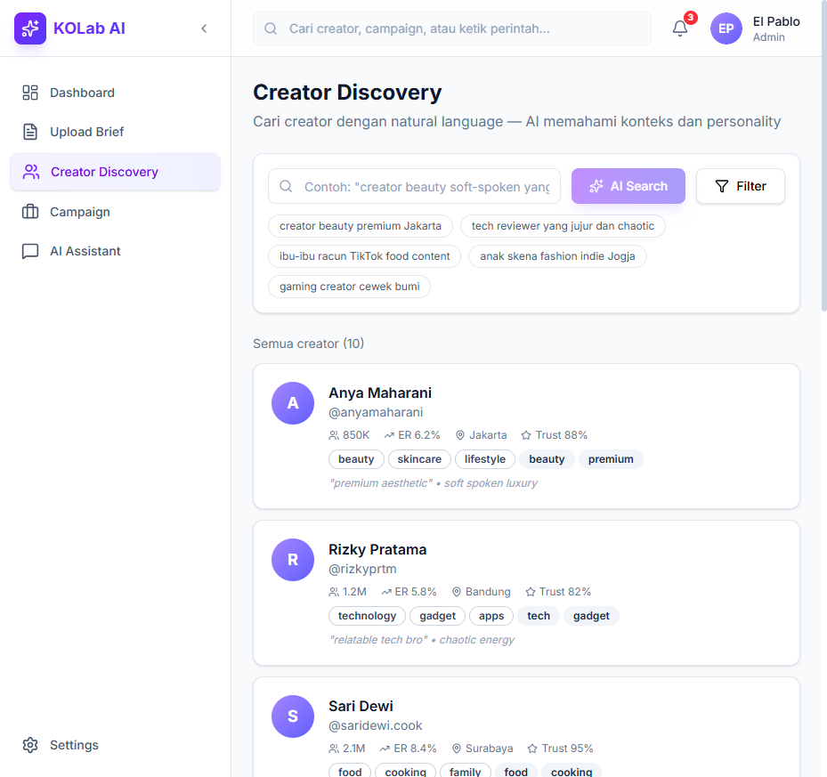
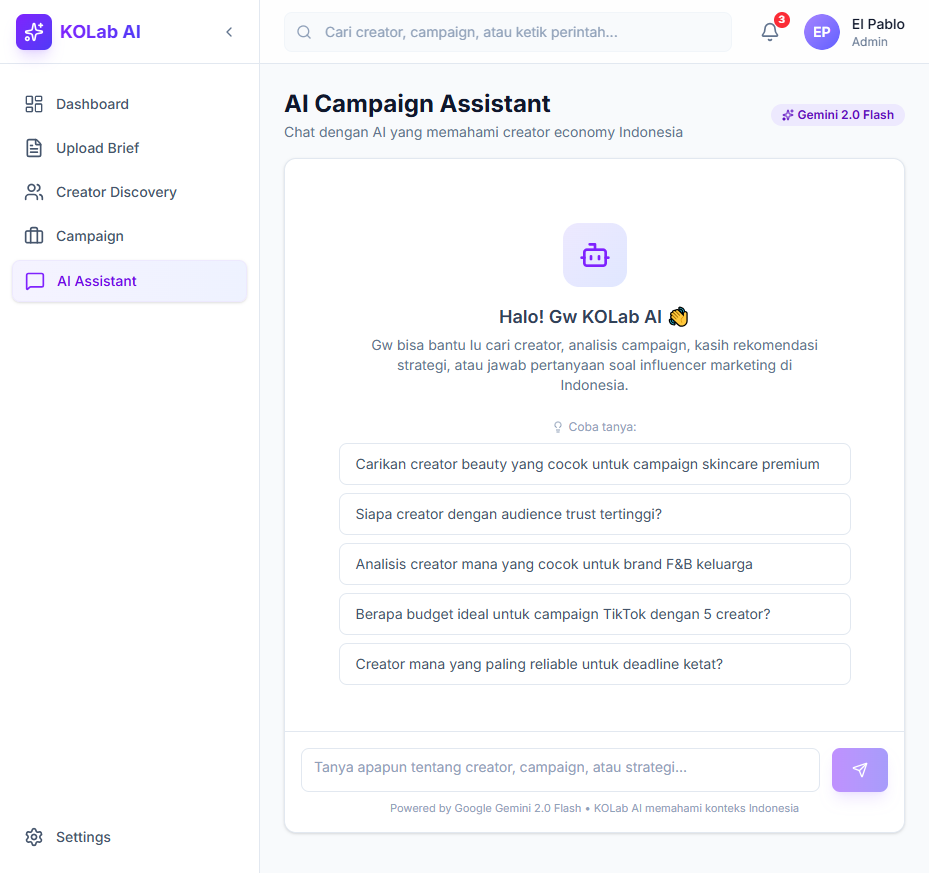
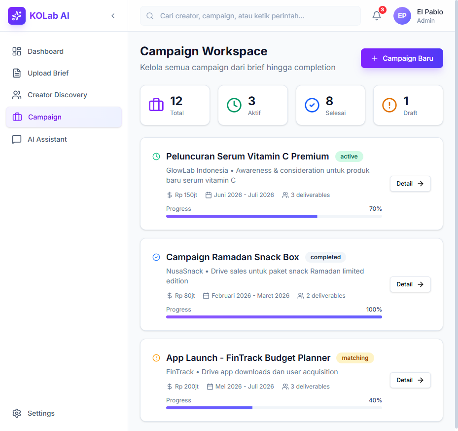
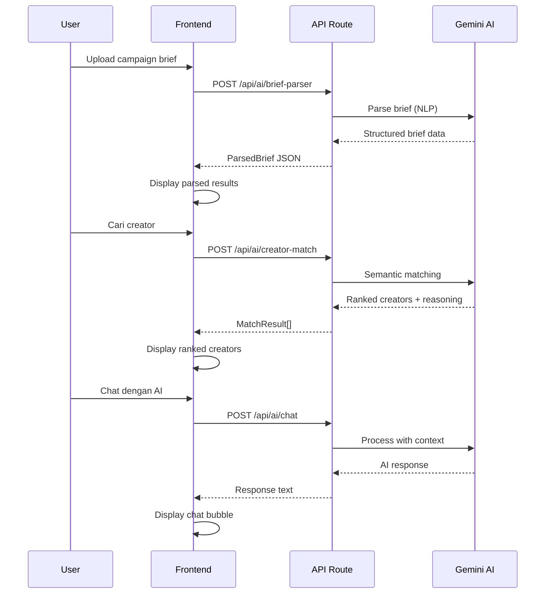

<div align="center">

# 🤖 KOLab AI

### AI Campaign Intelligence Engine untuk Creator Economy Indonesia

[](https://github.com/el-pablos/kolab-ai/actions)
[](https://nextjs.org)
[](https://typescriptlang.org)
[](https://ai.google.dev)
[](https://tailwindcss.com)
[](LICENSE)
[](https://goo.gle/jvc_credit)

**Bukan sekadar database KOL. KOLab AI adalah campaign intelligence engine yang memahami personality creator, audience trust, dan konteks lokal Indonesia secara semantik.**

[🚀 Live Demo](https://projek-juara-vibecoded.vercel.app) · [📖 Dokumentasi](#arsitektur) · [🐛 Report Bug](https://github.com/el-pablos/kolab-ai/issues)

</div>

---

## 📋 Daftar Isi

- [Tentang Projek](#tentang-projek)
- [Kenapa KOLab AI Beda?](#kenapa-kolab-ai-beda)
- [Fitur Utama](#fitur-utama)
- [Screenshots](#screenshots)
- [Arsitektur](#arsitektur)
- [Tech Stack](#tech-stack)
- [Struktur Projek](#struktur-projek)
- [Cara Install & Jalankan](#cara-install--jalankan)
- [API Endpoints](#api-endpoints)
- [Testing](#testing)
- [Deployment](#deployment)
- [Roadmap](#roadmap)
- [Kontributor](#kontributor)

---

## Tentang Projek

**KOLab AI** adalah platform AI-native yang dibangun untuk merevolusi cara brand dan agency di Indonesia menemukan dan mengelola creator/KOL untuk campaign mereka. 

Di Indonesia, platform influencer marketing yang ada sekarang masih bersifat "database + filter" — cari creator berdasarkan followers, engagement rate, lokasi, selesai. Itu pendekatan yang sudah ketinggalan zaman.

KOLab AI mengambil pendekatan yang fundamentally berbeda: **semantic intelligence**. AI kami (powered by Google Gemini 2.0) benar-benar memahami:

- **Personality creator** — bukan cuma angka, tapi vibe, tone, humor style, energy
- **Audience trust** — bukan cuma engagement rate, tapi seberapa audience percaya rekomendasi creator
- **Konteks lokal Indonesia** — memahami "cewek bumi", "anak skena", "ibu-ibu racun TikTok", "konten tongkrongan"
- **Campaign fit** — semantic matching antara brief campaign dengan personality creator

Ini bukan "another KOL platform". Ini adalah **Palantir untuk creator economy Indonesia**.

---

## Kenapa KOLab AI Beda?

| Aspek | Platform Biasa | KOLab AI |
|-------|---------------|----------|
| Pencarian | Filter: followers, ER, lokasi | Natural language: "cari creator beauty soft-spoken yang audience-nya ibu-ibu 25-35" |
| Matching | Manual shortlist | AI semantic matching berdasarkan personality fit |
| Understanding | Database statis | AI memahami vibe, tone, humor, authenticity |
| Brief Processing | Manual input form | Upload brief → AI auto-parse semua informasi |
| Konteks Lokal | Generic global | Memahami slang, niche, dan budaya creator Indo |
| Intelligence | Dashboard reporting | Campaign memory engine yang belajar dari setiap campaign |

---

## Fitur Utama

### 🧠 Brief Parser AI
Upload campaign brief dalam format apapun — AI menganalisis dan mengekstrak objective, tone, target audience, budget, deliverables, dan profil creator ideal secara otomatis dalam hitungan detik.

### 🔍 Semantic Creator Search
Cari creator menggunakan natural language. Bukan sekadar filter, tapi AI yang memahami intent pencarian dan mencocokkan dengan personality creator secara semantik.

### 🎯 Creator-Campaign Fit Scoring
Setiap creator mendapat fit score berdasarkan 6 dimensi: audience fit, tone fit, niche fit, budget fit, reliability score, dan engagement quality. Lengkap dengan reasoning AI kenapa creator tersebut cocok atau tidak.

### 👤 AI Personality Profiling
Setiap creator punya AI-generated personality profile yang mencakup tone, humor style, energy level, authenticity score, dan audience trust analysis.

### 💬 AI Campaign Assistant
Chat interface yang memahami konteks campaign dan creator database. Tanya rekomendasi, analisis, atau strategi kapan aja — AI menjawab dengan data dan insight yang actionable.

### 📊 Campaign Workspace
Kelola semua campaign dari brief hingga completion. Track progress, monitor deliverables, dan lihat performance metrics dalam satu dashboard.

---

## Screenshots

### Landing Page

*Hero section dengan value proposition yang jelas dan statistik platform*

### Dashboard

*Overview campaign intelligence: stats, active campaigns, top creators, dan budget tracking*

### Creator Discovery

*Semantic search dengan natural language dan suggested queries untuk konteks Indonesia*

### AI Chat Assistant

*Chat interface powered by Gemini 2.0 Flash dengan suggested questions*

### Campaign Workspace

*Kelola campaign dari brief hingga completion dengan progress tracking*

### Creator Profile

*AI personality analysis, trust metrics, audience demographics, dan rate card*

---

## Arsitektur

```mermaid
graph TB
    subgraph Frontend["Frontend (Next.js 14 App Router)"]
        LP[Landing Page]
        DB[Dashboard]
        BP[Brief Upload]
        CD[Creator Discovery]
        CP[Creator Profile]
        CW[Campaign Workspace]
        CH[AI Chat]
    end

    subgraph API["API Layer (Next.js Route Handlers)"]
        A1[/api/ai/brief-parser]
        A2[/api/ai/creator-match]
        A3[/api/ai/chat]
    end

    subgraph AI["AI Engine"]
        GM[Google Gemini 2.0 Flash]
        EM[Text Embedding 004]
        CS[Cosine Similarity]
    end

    subgraph Data["Data Layer"]
        CR[Creator Profiles - 10 Indo creators]
        CA[Campaign Data]
        ST[Dashboard Stats]
    end

    Frontend --> API
    API --> AI
    API --> Data
    AI --> GM
    AI --> EM
    EM --> CS

    style Frontend fill:#f0f0ff,stroke:#7c3aed
    style API fill:#f0fff0,stroke:#059669
    style AI fill:#fff0f0,stroke:#dc2626
    style Data fill:#fffff0,stroke:#d97706
```

### Flow Diagram



---

## Tech Stack

| Layer | Teknologi | Alasan |
|-------|-----------|--------|
| **Framework** | Next.js 16 (App Router) | Server components, API routes, optimal performance |
| **Language** | TypeScript (strict) | Type safety, better DX, fewer bugs |
| **AI Engine** | Google Gemini 2.0 Flash | Fast, capable, multimodal, gratis via AI Studio |
| **Styling** | Tailwind CSS 4 | Utility-first, rapid development, consistent design |
| **UI Components** | shadcn/ui + Radix UI | Accessible, customizable, production-ready |
| **Animation** | Framer Motion | Smooth, performant animations |
| **Icons** | Lucide React | Consistent, lightweight icon set |
| **Charts** | Recharts | Composable chart components |
| **Testing** | Jest + Testing Library | Industry standard, reliable |
| **CI/CD** | GitHub Actions | Auto test, build, deploy |
| **Deployment** | Vercel + Cloud Run ready | Edge network, instant deploys |
| **Containerization** | Docker (multi-stage) | Optimized production image |

---

## Struktur Projek

```
kolab-ai/
├── .github/
│   └── workflows/
│       └── ci.yml                 # CI/CD pipeline
├── public/
│   └── images/
│       └── screenshots/           # Screenshot tiap halaman
├── src/
│   ├── __tests__/                 # Unit tests
│   │   ├── api/
│   │   │   ├── brief-parser.test.ts
│   │   │   ├── chat.test.ts
│   │   │   └── creator-match.test.ts
│   │   └── lib/
│   │       ├── data.test.ts
│   │       ├── gemini.test.ts
│   │       └── utils.test.ts
│   ├── app/
│   │   ├── (dashboard)/           # Dashboard layout group
│   │   │   ├── brief/             # Upload Brief page
│   │   │   ├── campaign/          # Campaign Workspace
│   │   │   ├── chat/              # AI Chat Assistant
│   │   │   ├── creators/          # Creator Discovery
│   │   │   │   └── [id]/          # Creator Profile (dynamic)
│   │   │   ├── dashboard/         # Main Dashboard
│   │   │   └── layout.tsx         # Shared dashboard layout
│   │   ├── api/ai/                # API routes
│   │   │   ├── brief-parser/
│   │   │   ├── chat/
│   │   │   └── creator-match/
│   │   ├── globals.css
│   │   ├── layout.tsx             # Root layout
│   │   └── page.tsx               # Landing page
│   ├── components/
│   │   ├── layout/                # Sidebar, Navbar, DashboardLayout
│   │   └── ui/                    # Reusable UI components
│   ├── lib/
│   │   ├── ai/                    # AI engine modules
│   │   │   ├── brief-parser.ts    # Brief parsing logic
│   │   │   ├── chat-engine.ts     # Chat processing
│   │   │   ├── creator-matcher.ts # Semantic matching
│   │   │   ├── gemini.ts          # Gemini client & utils
│   │   │   └── index.ts           # Barrel export
│   │   ├── data/                  # Seed data
│   │   │   ├── campaigns.ts
│   │   │   └── creators.ts        # 10 creator profiles Indo
│   │   └── utils.ts               # Utility functions
│   └── types/
│       └── index.ts               # TypeScript type definitions
├── .env.example                   # Environment template
├── .gitignore                     # Comprehensive gitignore
├── Dockerfile                     # Multi-stage Docker build
├── jest.config.ts                 # Jest configuration
├── next.config.ts                 # Next.js config (standalone)
├── package.json
├── tsconfig.json
└── README.md                      # Dokumentasi ini
```

---

## Cara Install & Jalankan

### Prerequisites

- Node.js 22+
- npm 10+
- Google Gemini API Key (gratis dari [AI Studio](https://aistudio.google.com))

### Setup Lokal

```bash
# 1. Clone repository
git clone https://github.com/el-pablos/kolab-ai.git
cd kolab-ai

# 2. Install dependencies
npm install

# 3. Setup environment variables
cp .env.example .env.local
# Edit .env.local dan masukkan GEMINI_API_KEY

# 4. Jalankan development server
npm run dev

# 5. Buka http://localhost:3000
```

### Environment Variables

| Variable | Deskripsi | Required |
|----------|-----------|----------|
| `GEMINI_API_KEY` | API key dari Google AI Studio | ✅ |
| `NEXT_PUBLIC_APP_URL` | URL aplikasi | ❌ |
| `NEXT_PUBLIC_APP_NAME` | Nama aplikasi | ❌ |

---

## API Endpoints

### POST `/api/ai/brief-parser`

Parse campaign brief menggunakan Gemini AI.

**Request:**
```json
{
  "brief": "Campaign skincare untuk wanita 20-35 tahun..."
}
```

**Response:**
```json
{
  "result": {
    "title": "Campaign Skincare",
    "brand": "GlowLab",
    "objective": "Awareness",
    "targetAudience": { "ageRange": "20-35", "gender": "70% female" },
    "tone": ["premium", "educational"],
    "keywords": ["skincare", "vitamin c"],
    "idealCreatorProfile": "Creator beauty dengan vibe premium..."
  }
}
```

### POST `/api/ai/creator-match`

Semantic matching creator dengan brief atau natural language query.

**Request (query mode):**
```json
{
  "query": "creator beauty soft-spoken yang audience-nya ibu-ibu"
}
```

**Request (brief mode):**
```json
{
  "brief": { /* ParsedBrief object */ }
}
```

**Response:**
```json
{
  "results": [
    {
      "creator": { /* Creator object */ },
      "score": 92,
      "breakdown": {
        "audienceFit": 95,
        "toneFit": 90,
        "nicheFit": 88,
        "budgetFit": 85,
        "reliabilityScore": 95,
        "engagementQuality": 92
      },
      "reasoning": "Creator ini sangat cocok karena..."
    }
  ]
}
```

### POST `/api/ai/chat`

Chat dengan AI Campaign Assistant.

**Request:**
```json
{
  "message": "Siapa creator dengan trust level tertinggi?",
  "messages": []
}
```

**Response:**
```json
{
  "response": "Berdasarkan data yang gw punya, creator dengan trust level tertinggi adalah..."
}
```

---

## Testing

```bash
# Jalankan semua test
npm test

# Jalankan dengan coverage
npm run test:coverage

# Watch mode (development)
npm run test:watch
```

### Test Results

```
Test Suites: 6 passed, 6 total
Tests:       39 passed, 39 total
Snapshots:   0 total
```

Test coverage mencakup:
- ✅ Utility functions (cn, class merging)
- ✅ AI engine (cosine similarity, vector operations)
- ✅ Data integrity (creator profiles, campaigns, stats)
- ✅ API validation (brief parser, chat, creator match)

---

## Deployment

### Vercel (Production)

App sudah live di: **https://projek-juara-vibecoded.vercel.app**

Setiap push ke `main` otomatis trigger deployment via Vercel Git Integration.

### Docker (Cloud Run Ready)

```bash
# Build Docker image
docker build -t kolab-ai .

# Run locally
docker run -p 8080:8080 -e GEMINI_API_KEY=your_key kolab-ai

# Deploy ke Cloud Run
gcloud run deploy kolab-ai \
  --source . \
  --region asia-southeast2 \
  --allow-unauthenticated \
  --set-env-vars GEMINI_API_KEY=your_key
```

### CI/CD Pipeline

GitHub Actions otomatis menjalankan:
1. **Test** — Semua unit test harus passed
2. **Build** — TypeScript compilation + Next.js build
3. **Deploy** — Auto deploy ke Cloud Run (jika secrets configured)

---

## Roadmap

- [x] Brief Parser AI (Gemini)
- [x] Semantic Creator Search
- [x] Creator-Campaign Fit Scoring
- [x] AI Personality Profiling
- [x] AI Campaign Assistant (Chat)
- [x] Campaign Workspace
- [x] Dashboard Analytics
- [x] Docker + Cloud Run ready
- [x] CI/CD Pipeline
- [x] Unit Testing (39 tests passed)
- [ ] Real-time social media data integration (TikTok, IG API)
- [ ] Creator embeddings dengan vector database (pgvector)
- [ ] Campaign memory engine (belajar dari campaign sebelumnya)
- [ ] Audience trust graph analysis
- [ ] Multi-tenant support untuk agency
- [ ] Payment & invoice tracking
- [ ] Creator outreach automation

---

## Kontributor

<table>
  <tr>
    <td align="center">
      <a href="https://github.com/el-pablos">
        
        <br />
        <sub><b>El Pablo</b></sub>
      </a>
      <br />
      <sub>Creator & Developer</sub>
    </td>
  </tr>
</table>

---

## Lisensi

Projek ini dibuat untuk kompetisi **#JuaraVibeCoding 2026** oleh Google Indonesia.

MIT License — silakan gunakan, modifikasi, dan distribusikan.

---

<div align="center">

**Built with ❤️ for #JuaraVibeCoding 2026**

Powered by [Google Gemini AI](https://ai.google.dev) · Deployed on [Vercel](https://vercel.com)

</div>
